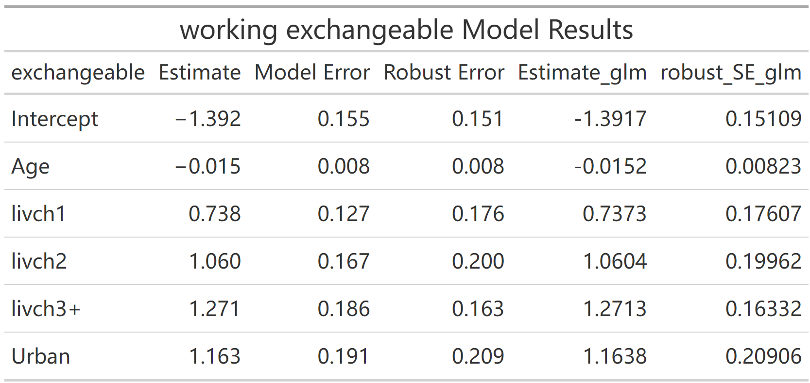
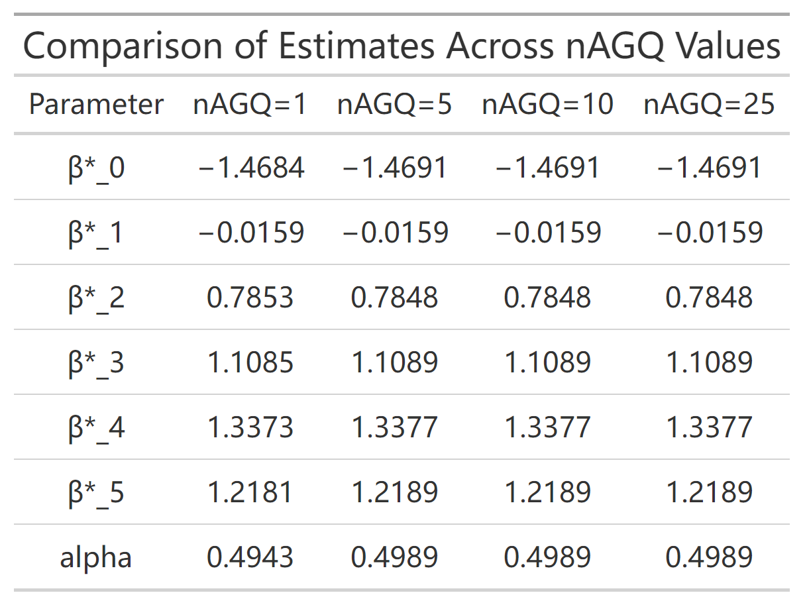
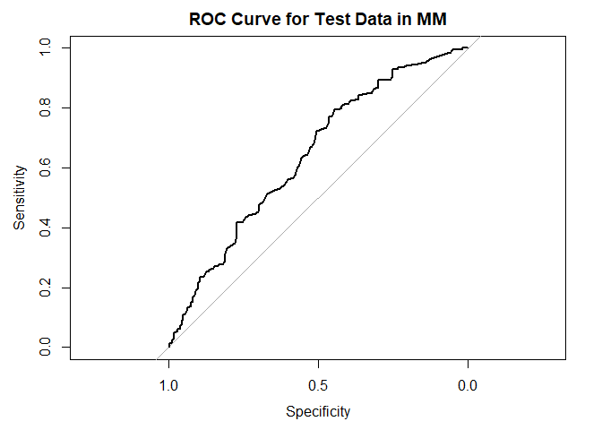
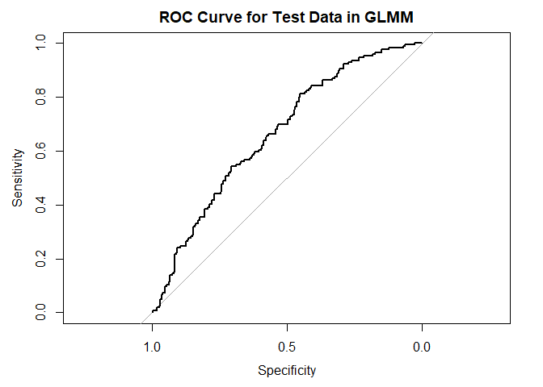

# Section 1

## Abstract

In this paper, I will use the Contraception dataset from the R package to study the factors influencing women’s use of contraceptive methods. These data, collected from the 1988 Bangladesh Fertility Survey[1], provide information on contraceptive use among women in urban and rural areas. I will employ both the GLMM model and the marginal model to investigate this question and compare their performances. Finally, whether in terms of goodness of fit or predictive ability, the GLMM outperforms the marginal model in this question. Briefly, holding other factors constant, older women are more likely to use contraception, younger women are less likely, women with more children are more likely to use contraception and women living urban are more likely to use contraception.

## GEE with marginal model

Recall the corvariate I will put in my model: \textbf{livch}, \textbf{urban} and \textbf{age}, consider the model:

$$
\text{logit} \, \text{Pr}(Y_{ki} | \mathbf{X}_{ki}) = \beta_0 + \beta_1 \text{Age}_{ki} + \beta_2 \text{livch1}_{ki} + \beta_3 \text{livch2}_{ki} + \beta_4 \text{livch3}_{ki} + \beta_5 \text{Urban}_{ki}
$$

In this equation, exp($\beta_{2}$) represents the odds ratio for livch1 compared to the reference category of livch (e.g., livch0). This shows how the odds of the outcome change when livch1 is present, relative to the baseline livch0, holding all other variables constant.



## Max liklihood with GLMM (random intercept)

In this project, if we make $Z_{ki}$ = 1, then we will get a GLMM model with random intercept. The exact model is:

$$
\text{logit} \, \text{Pr}(Y_{ki} | \mathbf{X}_{ki}, u_k) = \beta_0 + \gamma_{0k} + \beta_1 \text{Age}_{ki} + \beta_2 \text{livch1}_{ki} + \beta_3 \text{livch2}_{ki} + \beta_4 \text{livch3}_{ki} + \beta_5 \text{Urban}_{ki}
$$

where $\gamma_{0k} \sim Normal(0, \sigma^{2}_{\gamma})$

Before we make a regression, we should determine the best number of nodes, the result shows that using a GH method is welcomed although the returns quickly diminish as the number of nodes increases. I decide nAGQ = 5 finally. This can increase the accuracy of the approximation to the integrated likelihood.



## Prediction

Next, I want to compare the predictive abilities of the two models by using the test data that was set aside at the beginning of the project. The resulting ROC curves are shown below:




According to the plot and the result, we know the AUC for marginal model is 0.6386 which is smaller than AUC for marginal model, 0.6621. Therefore, the GLMM model has a better prediction ability. However, the AUC of both model are less than 0.7 which means a poor performance in prediction generally. 

In summary, whether in terms of goodness of fit or predictive ability, the GLMM outperforms the marginal model.

# Section 2

Answer the questions about shell commands 

**the answer is based on the git bash instead of git cmd(powershell)**

```bash
$ cd /d/Study/linux_learn/student_test_2025_spring
```

- How would you list all files in the current directory, including hidden ones?

```bash
$ ls -A
```

- What command would you use to find the number of lines in a file named data.txt?

```bash
$ wc -l data.txt
```

- How can you search for the string "error" in all *.log files in the current directory?

```bash
$ grep -n "error" *.log
```

- Describe how you would change the permissions of a file named script.sh to make it executable.

```bash
$ chmod +x script.sh
```

- How would you display the last 20 lines of a file named output.log?

```bash
$ tail -n 20 output.log
```

- Explain how to combine the contents of file1.txt and file2.txt into a new file named combined.txt.

```bash
$ cat data.txt data_2.txt > combined.txt
```

- How would you check for the presence of the word "Completed" in a file named status.txt and display the line containing it?

```bash
$ grep -n "Completed" status.txt
```

- What command can you use to sort the lines in a file named unsorted.txt in alphabetical order and save the result to a new file named sorted.txt?

```bash
$ sort unsorted.txt > sorted.txt
```