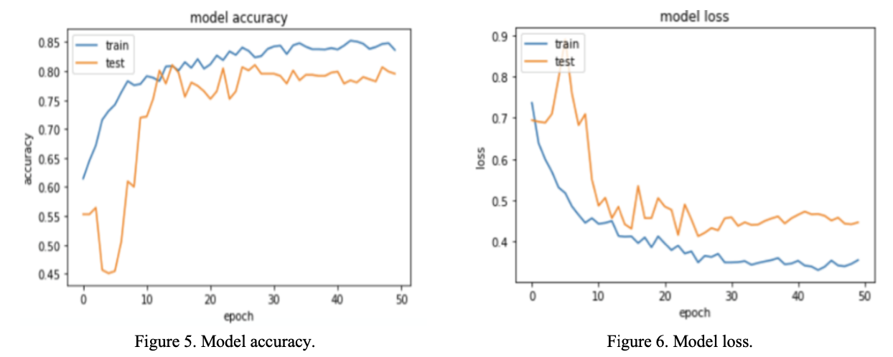
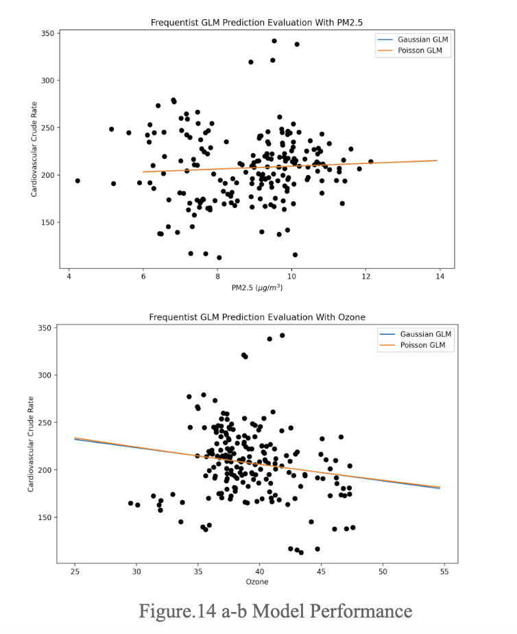

## Section 1
### Overweight Students
Sept 2023-Dec 2023

• Preprocessed and analyzed two datasets, each with 10k+ rows, spanning 5 years of record on students overweight and school lunch information in *R*

• Developed *t-tests* and *linear regression* analysis to predict the percentage of overweight students in NY states

Link: https://cara-dong.github.io/nyweight.github.io/

### Cardiovascular Mortality and Air Pollution Causality Modeling
Jan 2023 - May 2023

• Investigated the absence of causality between PM2.5 and ozone levels and the crude mortality rate of cardiovascular disease, applying *causal inference* on three CDC public datasets, each with 100M+ observations

• Predicted the crude mortality rate of cardiovascular disease from PM2.5 and ozone concentration levels by developing various *GLMs* and the *K-NN* method (RMSE between 35 and 40) with *Python*

## Skin Cancer Image Classification with Deep Learning
May 2021 - Aug 2021

• Organized and labeled 3000+ images of skin cancer with *Python* in *Google Colab* to serve as training data

• Implemented a *CNN classification model* with Keras to forecast the possibility of a positive diagnosis, achieving an AUC for ROC of 0.82 and making suggestions for those detected with the possibility of getting the cancer

Link: https://doi.org/10.1117/12.2631424

## Section 2
- Describe the difference between `cd`, `cd ..`, and `cd ~`.

`cd`: Stands for "change directory." It is used to change the current working directory to the specified directory. For example, cd Documents changes the working directory to the Documents directory.

`cd ..`: Moves up one directory level from the current directory. It is equivalent to "change directory to the parent directory."

`cd ~`: Changes the working directory to the user's home directory. It is a shortcut for "change directory to the home directory."

- What is the purpose of the `chmod` command?

The chmod command is used to change the permissions of files and directories in Unix-like operating systems. It stands for "change mode."
It allows the user to modify the read, write, and execute permissions for the file owner, group, and others.

- How would you display the value of the PATH environment variable?

echo $PATH

- In the current folder, you have hunderds of files in `.csv`, `.log`, `.out` format.
    - How to count the line numbers of each `.csv` file?: wc -l *.csv
    
    - How to print the last line of each `.log` file?: tail -n 1 *.log
    
    - How to print a list of `.out` files that contains `Error` somewhere in the file, and also print the line that includes `Error`?: grep -H "Error" *.out
    
- How would you print the second column of a space-separated file (for example, `test_data.out`) using `awk`?: awk '{print $2}' test_data.out

- Describe the difference between `ps`, `top`, `htop` commands.

`ps`: Stands for "process status." It is a command-line utility for viewing information about running processes on a Unix-like operating system. It provides a snapshot of the current processes, including their process IDs (PIDs), CPU and memory usage, and other details.

`top`: Is an interactive command-line utility for monitoring system processes in real-time. It displays a dynamic, continuously updated list of running processes, along with their resource usage (CPU, memory, etc.). Users can interactively sort and filter the process list and send signals to processes.

`htop`: Is an interactive process viewer for Unix-like operating systems. It is similar to top but provides additional features such as color-coded display, mouse support, and easier navigation. htop also allows users to scroll vertically and horizontally, and it provides tree-view representation of processes.