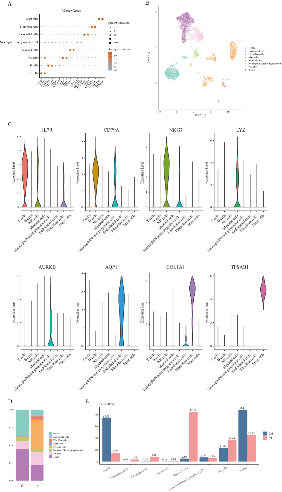
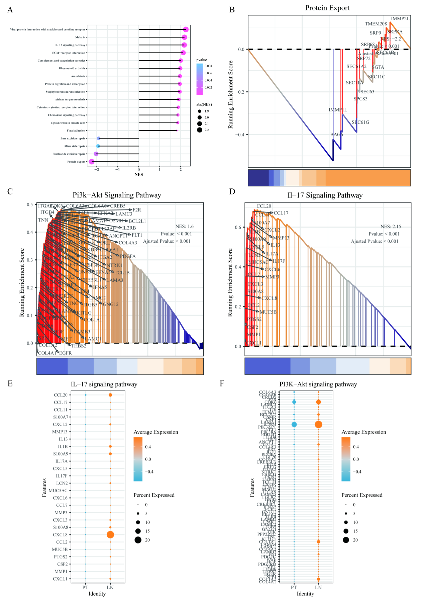

# Section 1

---

# **Single-cell transcriptomic data reveal T-cell subpopulations in primary and lymph node-metastatic gastric cancer**

# **1. Introduction**  

**Gastric cancer (GC)** is one of the most prevalent cancers worldwide, ranking as the fifth most common malignancy and the third leading cause of cancer-related deaths.

**Lymph node metastatic (LN) gastric cancer** represents a **critical stage** in **tumor progression**, where **lymph node involvement** significantly affects prognosis. 

This study conducts a **comprehensive analysis of T-cell subpopulations** in **primary and lymph node-metastatic gastric cancer**, focusing on their **functional heterogeneity** and **signaling pathways**.

---

# **2. Materials and Methods**  

## **2.1 Single-cell Dataset Sources**  
We obtained **single-cell RNA sequencing (scRNA-seq) data** from the **Gene Expression Omnibus (GEO)** database ([GSE163558](https://www.ncbi.nlm.nih.gov/geo/)). This dataset includes **primary gastric cancer (PT)** and **lymph node metastatic gastric cancer (LN)** samples. After filtering, we selected:  
- **Three PT samples**  
- **Two LN samples**  

## **2.2 Single-cell Data Analysis**  
Single-cell RNA sequencing data were processed using the *Seurat package* in R. The workflow included:  
1. **Quality Control**: Retained cells with mitochondrial gene percentage **< 10%** and gene count between **200 - 6000**.  
2. **Normalization & Scaling**: Used *SCTransform* function.  
3. **Dimensionality Reduction**: Applied *PCA* (first 20 components).  
4. **Batch Effect Correction**: Used *Harmony* package.  
5. **Clustering**: Identified cell types via *UMAP* and *FindClusters* functions.  
6. **Cell Type Annotation**: Based on *CellMarker 2.0*.

---

# **3. Results**  

## **3.1 Single-cell Landscape in PT and LN Samples**  
We identified **eight major cell types** through clustering and annotation:  *B cells*, *Endothelial cells*, *Fibroblasts*, *Mast cells*, *Myeloid cells*, *Neutrophil/Neural progenitor cells*, *NK cells* and *T cells*. 

The proportion of *T cells* was **higher in LN samples** compared to PT samples, whereas *Myeloid cells* were more abundant in **PT samples**.  

**Figure 1**: **Single-cell landscape in PT and LN samples**  


## **3.2 T Cell Pathway Heterogeneity in PT and LN Samples**  
Pathway enrichment analysis revealed:  
- Upregulated in LN samples: *PI3K-Akt & IL-17* signaling pathways  
- Upregulated in PT samples: Protein Export pathway  

**Figure 2**: **Pathway enrichment of T cells**  
  

# **4. Discussion**  
Our study demonstrated the functional heterogeneity of *T cells* in gastric cancer metastasis and these insights contribute to a deeper understanding of *T-cell* dynamics in GC and highlight potential targets for future immunotherapy research.
---

# Section 2

---
- How would you list all files in the current directory, including hidden ones?  

```bash
ls -la  
```  

- What command would you use to find the number of lines in a file named `data.txt`?  

```bash
wc -l data.txt  
```  

- How can you search for the string "error" in all `*.log` files in the current directory?  

```bash
grep "error" *.log  
```  

- Describe how you would change the permissions of a file named `script.sh` to make it executable.  

Firstly, check the file’s current status:  

```bash
ls -l script.sh
```  

Then, to make script.sh executable, run:  

``` bash
chmod +x script.sh
```  

Check permissions again:  

```bash
ls -l script.sh  
```  

Finally, run the script:  

```bash
./script.sh  
```  

- How would you display the last 20 lines of a file named output.log?  

```bash
tail -n 20 output.log  
```  

- Explain how to combine the contents of `file1.txt` and `file2.txt` into a new file named combined.txt.  

Read the contents of both files in order using *cat* and  create a new file "combined.txt" that will contain the merged content.  

```bash
cat file1.txt file2.txt > combined.txt
```  

- How would you check for the presence of the word "Completed" in a file named `status.txt` and display the line containing it?

```bash
grep "Completed" status.txt
```  

- What command can you use to sort the lines in a file named `unsorted.txt` in alphabetical order and save the result to a new file named `sorted.txt`?

```bash
sort unsorted.txt > sorted.txt
```  

---