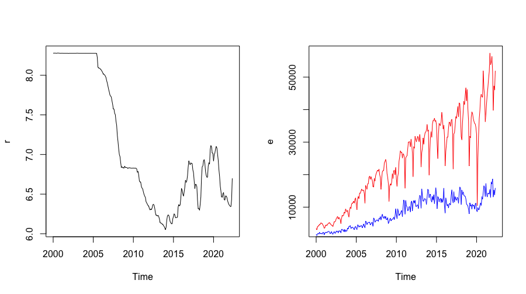

# Section 1
## Abstract

It is widely acknowledged that a low exchange rate of the Renminbi against the US dollar increases the volume and amount of China's exports to the US, while a rise in the exchange rate leads to a larger volume of imports. Conversely, this paper seeks to explore whether the volumes of imports and exports also have an impact on the exchange rate. Through the construction of three models, we find that fluctuations in Chinas import and export volumes to the US affect the fluctuations in the exchange rate between the Renminbi and the US dollar, with the impact of import volumes being more significant. Moreover, there exists a certain linear relationship among these three variables. The models predict that over the next two years, as export volumes fluctuate upwards and import volumes stabilize, the exchange rate will briefly increase before stabilizing. Although fluctuations in both import and export volumes contribute to the volatility of the exchange rate, there remains 21% of the variance that cannot be explained by these two factors. Therefore, more series can be inserted into the VAR model in the future for fitting and prediction, to provide a more accurate forecast of exchange rate fluctuations.

**Keywords: Exchange Rate; Import and Export Volumes; Time Series; ARIMA Model; GARCH Model; VAR Model**

## Background and Significance

### Background

China-US trade has always been an important part of the global trade market and an indispensable economic support within the Chinese economic system. In these transactions, the exchange rate plays a crucial role. According to political economy, it is known that a low exchange rate of the Renminbi against the US dollar increases China's exports to the US, while a rise in the exchange rate will lead to a larger volume of imports. Conversely, whether the volumes of imports and exports also impact the exchange rate is precisely the question this paper intends to explore.

### Significance

Through time series analysis and forecasting the development trend of the Renminbi against the US dollar exchange rate, understanding the contribution of import and export volume fluctuations to exchange rate volatility, to some extent, the conclusions of this paper can provide some empirical evidence for decision-makers. This helps them to reasonably arrange China-US trade volumes, aiming for the appreciation of the Renminbi.

## Theoretical Introduction

### ARIMA Model

Suppose {${x_{t}}$} is a non-stationary series that becomes stationary after ${d}$ times of differencing operations, it is then termed an autoregressive integrated moving average model. If the differenced series satisfies the ARMA($p$,$q$) model, then {${x_{t}}$} is considered an ARIMA($p$,$d$,$q$) process. The model equation is: Let ${y_{t}=x_{t}-x_{t-1}}$, then
$${y_{t}=\phi_{1}y_{t-1}+\phi_{2}y_{t-2}+\dots +\phi_{p}y_{t-p}+\varepsilon_{t}-\theta_{1}\varepsilon_{t-1}-\theta_{2}\varepsilon_{t-2}-\dots -\theta_{q}\varepsilon_{t-q}}$$

Expressed using the series symbol ${x_{t}}$, it becomes:
$${x_{t}-x_{t-1}=\phi_{1}(x_{t-1}-x_{t-2})+\phi_{2}(x_{t-2}-x_{t-3})+\dots +\phi_{p}(x_{t-p}-x_{t-p-1})+\varepsilon_{t}-\theta_{1}\varepsilon_{t-1}-\theta_{2}\varepsilon_{t-2}-\dots -\theta_{q}\varepsilon_{t-q}}$$

Simplified, it yields:
$${x_{t}=(1+\phi_{1})x_{t-1}+(\phi_{2}-\phi_{1})x_{t-2}+\dots +(\phi_{p}-\phi_{p-1})x_{t-p}-\phi_{p}x_{t-p-1}+\varepsilon_{t}-\theta_{1}\varepsilon_{t-1}-\theta_{2}\varepsilon_{t-2}-\dots -\theta_{q}\varepsilon_{t-q}}$$

This is referred to as the model's differenced equation form. From the mutual transformations between these equations, it can be inferred that the ARIMA model is actually a combination of differencing operations and the ARMA model. Initially, it uses the method of differencing to transform a non-stationary time series into a stationary one, then solves it using the ARMA model.

## Empirical Analysis

### 1. Data Source

*The data for this empirical analysis comes from the [CEIC database](https://info.ceicdata.com)*, selecting the monthly average exchange rate of the Renminbi to the US dollar, the total monthly exports from China to the US, and the total monthly imports from the US to China for the period from January 2000 to May 2022. There are a total of 269 data points, with the import and export amounts denoted in millions of US dollars.

### 2. Descriptive Statistics of the Original Data

```r
library(zoo)
library(imputeTS)
library(tseries)
library(forecast)
library(rugarch)
...
library(psych)
data <- read.table("/Users/luyuanyu/Desktop/China_Indicators.csv", sep=",", header = T)
r <- ts(data$Rate, start=c(2000, 1), end=c(2022, 5), frequency=12)
e <- ts(data$Exports, start=c(2000, 1), end=c(2022, 5), frequency=12)
i <- ts(data$Imports, start=c(2000, 1), end=c(2022, 5), frequency=12)
par(mfrow = c(1, 2))
plot(r)
plot(e, col="red")
lines(i, col="blue")
```

**The resulting time series plots are as follows:**


# Section 2
## Describe the difference between `cd`, `cd ..`, and `cd ~`.
`cd` changes the working directory to specific directory(or to home directory if leave blank). `cd ..` changes the working directory to the parent directory of the current directory. `cd ~` changes the working directory to the home directory of the user.

## What is the purpose of the `chmod` command?
`chmod` is used for the file owner to modify permissions, including changing the file system modes of files and directories, deciding who can read, write, or execute the file.

## How would you display the value of the PATH environment variable?
```echo $PATH```
## In the current folder, you have hunderds of files in `.csv`, `.log`, `.out` format.
### How to count the line numbers of each `.csv` file?
```wc -l *.csv```
### How to print the last line of each `.log` file?
```tail -n 1 *.log```
### How to print a list of `.out` files that contains `Error` somewhere in the file, and also print the line that includes `Error`?
```grep -H "Error" *.out```

## How would you print the second column of a space-separated file (for example, `test_data.out`) using `awk`?
```awk '{print $2}' test_data.out```

## Describe the difference between `ps`, `top`, `htop` commands.
`ps` provides snapshots of processes at a specific time. `top` offers a real-time overview of system processes, allowing for interactive monitoring and basic management. `htop` enhances a user-friendly interface, advanced features for process management, and supports a more comprehensive system monitoring.
