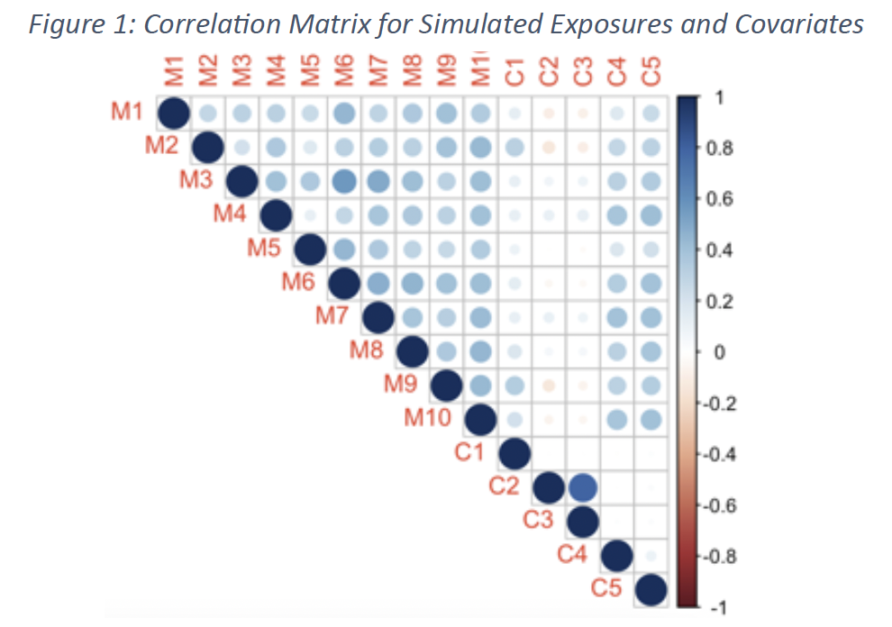

## My Research Project

### Introduction
Organisms are chronically exposed to thousands of chemicals in **environmental mixtures** (including soil, air, and water), and medical research has shown that a large proportion of chronic disease risk can be explained by multiple pathways of these exposures. Environmental mixtures typically consist of multiple continuous and correlated exposures with *nonlinear and interactive* relationships with key outcomes, such as those described in [Bangladesh Data](https://www.tandfonline.com/doi/full/10.1080/01621459.2021.1962889). In addition to the *high dimensionality* of exposure data, a common obstacle to this work is measuring and controlling for confounders, especially when these confounders are highly correlated with exposures or with each other. There is still an open question as to how to control for confounders when multiple confounders are present and there is also the outstanding question of how a stochastic approach would perform in the presence of multiple confounders that are moderately or highly correlated and where there is a complex relationship between these confounders and the outcome of interest, either by excluding confounders or by including them in the kernel function. Thus, the goal of our work is ultimately to help environmental health scientists employ optimal machine learning or other flexible methods in environmental mixtures studies to obtain conclusions that are as reliable and valid as possible.

### Simulation Study
We consider two scenarios: (1) metals have a linear effect on the outcome, while confounders have a nonlinear and interactive effect on the outcome, and (2) metals and confounders both have nonlinear and interactive effects on the outcome, including a metal confounder interaction. Moderate multicollinearity is induced, and noise is added for variation. For each scenario, we simulate 200 datasets consisting of 1000 observations each to replicate the range of observations often found in prospective epidemiological studies.
.